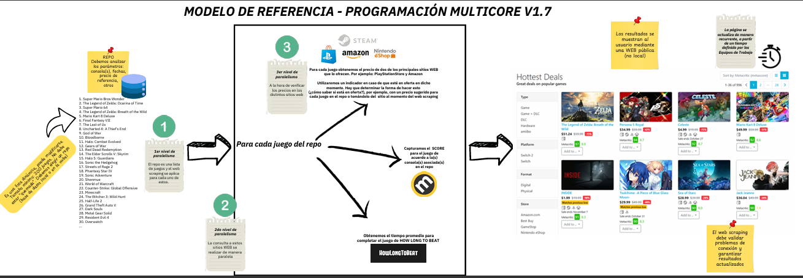

---

#  **Proyecto de Multicore – Web Scraping**

### *Catálogo Dinámico de Videojuegos con Paralelismo y GitHub Pages*



---

## 📸 Vista previa del proyecto

### 🔹 **Página principal**


### 🔹 **Vista de detalle de juego**


---

#  **Descripción General**

Este proyecto combina **Web Scraping**, **Paralelismo**, **Procesamiento automático de datos** y **GitHub Pages** para generar un **catálogo dinámico de videojuegos**, completamente actualizado cada 3 minutos.

Toda la información se almacena en JSON y luego se muestra en una página web moderna, elegante e interactiva.

---

#  **Problema Presentado**

En la industria del software, es común que existan plataformas que ofrecen productos (como videojuegos), pero:

###  Problemas identificados:

* La información de precios cambia constantemente.
* Los juegos aparecen en varias tiendas con descuentos diferentes.
* No existe un catálogo centralizado que recopile datos reales desde múltiples plataformas.
* Se debe procesar gran cantidad de URLs → **costoso sin paralelismo**.


---

#  **Solución Implementada**

Se construyó un sistema completamente automatizado que:

### 🔹 **1. Realiza Web Scraping en Paralelo**

Usa **tres niveles de paralelismo**:

1. **Primer nivel:** extracción de nombres
2. **Segundo nivel:** extracción de precios, descuentos e imágenes
3. **Tercer nivel:** duración aproximada (HowLongToBeat), calificaciones, formato, etc.

Esto permite procesar cientos de juegos en minutos.

---

### 🔹 **2. Recopila datos de 3 plataformas reales**

* **Steam**
* **GOG**
* **GMG (Green Man Gaming)**


---

### 🔹 **3. Actualiza GitHub automáticamente**

Cada vez que el scraper finaliza:

```
git add results.json results.csv
git commit -m "Actualizar datos ..."
git push
```

Esto significa que **la página web SIEMPRE muestra datos recientes**.

---

### 🔹 **4. Publicación Automática con GitHub Pages**

GitHub Pages lee siempre el archivo:

```
index.html
```

Y la web se actualiza automáticamente cuando `results.json` cambia.

---

#  **Procesamiento del Proyecto**

## 🔸 Flujo de Ejecución

1. Se recolectan cientos de URLs por tienda (seeders)
2. Se procesan con **paralelismo controlado**
3. Se extraen datos reales de cada página
4. Utilizar los mejores precios recopilados
5. Se genera:

   * `results.json`
   * `results.csv`
6. Se mandan los datos automáticamente a GitHub
7. La web se actualiza con la nueva información

---

#  **Tecnologías Utilizadas**

### **Backend / Scraper**

* Python 3
* `aiohttp` → descargas en paralelo
* `aiofiles` → guardado asincrónico
* `BeautifulSoup4` + `lxml` → parsing HTML
* `subprocess` → push automático a GitHub
* Manejo de errores avanzado
* Expresiones regulares

### **Frontend**

* HTML5 + CSS3
* JavaScript Vanilla
* GitHub Pages (Deploy automático)

---

#  **Página Web (Catálogo de Juegos)**

La web:

✔ Filtra por tienda
✔ Filtra por formato (Digital / Físico)
✔ Filtra por plataforma (PC, PS4, PS5, Xbox, etc.)
✔ Ordena por precio, nombre, descuento, rating
✔ Busca por nombre
✔ Muestra detalles ampliados
✔ Linkea a la tienda original

---

#  **Cómo Ejecutar el Scraper**

### 1️⃣ Instalar dependencias

```bash
pip install aiohttp aiofiles beautifulsoup4 lxml
```

### 2️⃣ Ejecutar

```bash
python datos.py
```

El programa:

* Corre indefinidamente
* Recolecta datos cada 3 minutos
* Hace `git push` automáticamente

---

#  **Cómo Publicar la Web en GitHub Pages**

1. Subir el archivo **index.html**, `results.json` y el scraper a la raíz del repositorio
2. Entrar a **Settings → Pages**
3. Configurar

```
Source: main
Folder: /(root)
```

4. Guardar los cambios

La pagina web aparecere en:

```
https://danny7w7-coder.github.io/proyecto-multicore-web/
```

---

# 🔧 **Uso de GitHub paso a paso (para principiantes)**

### ✔ Clonar repositorio

```bash
git clone https://github.com/usuario/repositorio.git
```

### ✔ Agregar cambios

```bash
git add .
```

### ✔ Guardar cambios

```bash
git commit -m "Mi actualización"
```

### ✔ Subir a GitHub

```bash
git push
```

### ✔ Descargar cambios remotos

```bash
git pull
```

---

# 👤 **Autores del Proyecto**

### **Valeria Rojas Barrantes**

Estudiante de Ingeniería en Computacion — TEC

### **Dylan Méndez Zamora**

Estudiante de Ingeniería en Computacion — TEC

### **Danny González Molina**

Estudiante de Ingeniería en Computacion — TEC

---

#  **Conclusión**

Este proyecto demuestra cómo combinar:

* **Paralelismo**
* **Web Scraping**
* **Automatización**
* **Publicación continua**
* **Frontend dinámico**
